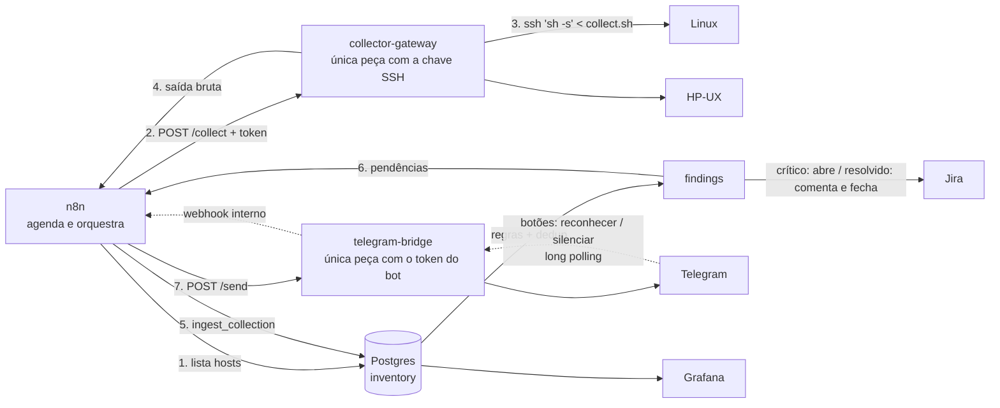
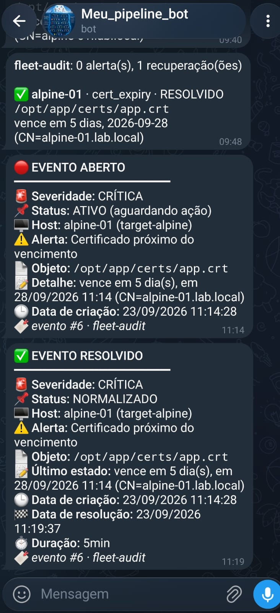

# agentless-fleet-audit

[](https://github.com/aguinaldomneto/agentless-fleet-audit/actions/workflows/ci.yml)

Inventário e compliance **sem agente** para servidores Linux e Unix (incluindo HP-UX), orquestrado com **n8n**, armazenado em **PostgreSQL** e visualizado no **Grafana**.

> Status: em construção. Coleta ponta a ponta funcionando (n8n → gateway → SSH → Postgres, com regras e deduplicação); alertas no Telegram, abertura e fechamento automático de chamado no Jira e dashboard Grafana provisionado como código.

## Problema

Em ambientes legados e híbridos é comum **não haver permissão para instalar agentes** (node_exporter, Zabbix agent, etc.), seja por política de mudança, suporte do fornecedor ou arquitetura (HP-UX em Itanium). Mesmo assim, é preciso responder perguntas como:

- Quais filesystems estão acima de 85%?
- Quais certificados vencem nos próximos 30 dias?
- Existe conta com UID 0 além do root?
- Qual o patch level (QPK) de cada HP-UX?

## Arquitetura



## Alertas

Um evento por mensagem, no formato de chamado, com três severidades e **lembrete enquanto o evento estiver aberto**:

| Severidade | Exemplos | Lembrete |
|---|---|---|
| 🔴 CRÍTICA | disco ≥ 90%, certificado ≤ 7 dias, UID 0 extra, falha de SSH | a cada 1 h |
| 🟠 ALTA | disco ≥ 85%, certificado ≤ 15 dias, coleta truncada | a cada 3 h |
| 🟡 MÉDIA | certificado ≤ 30 dias | a cada 8 h |

Cada alerta aberto vem com os botões **✅ Reconhecer** (pausa os lembretes até resolver) e **🔕 Silenciar 4h**. Se a severidade **subir**, o reconhecimento é desfeito e um novo alerta sai. Recuperação é sempre avisada, com data de resolução e duração. Intervalos ajustáveis com `make set-reminders`.

<p align="center"></p>

## Decisões técnicas

| Decisão | Motivo |
|---|---|
| **Agentless via SSH** (`sh -s < collect.sh`) | Nada é instalado nem gravado no servidor-alvo. Só exige uma conta com chave SSH. |
| **POSIX sh puro** | `bash`, `jq`, `python` e `base64` não são garantidos no HP-UX. Testado em dash, bash --posix e busybox. |
| **Saída `TIPO\|campo\|...`** em vez de JSON | Gerar JSON com escape correto em sh puro é frágil. Registro por linha é trivial de gerar e de parsear. |
| **Linha `END\|ok`** | Detecta saída truncada (queda de conexão) e marca a coleta como `partial`. |
| **`df -l` / `bdf -l`** | Só FS locais: um NFS *stale* travaria a coleta indefinidamente. |
| **Postgres, não Prometheus** | A maior parte dos dados é *estado* (usuários, certificados, patches), não métrica numérica de alta frequência. |
| **Tabela `findings` com índice único parcial** | Um achado aberto por (host, regra, objeto) → **sem alerta repetido** a cada coleta. |
| **Gateway separado com a chave SSH** | O n8n nunca tem a chave. Se ele for comprometido, não vira um trampolim de SSH para a frota. Entrada validada contra injeção de opções do ssh. |
| **Ingestão numa função SQL** | Parse e regras rodam em **uma transação**: nada fica gravado pela metade. A saída bruta fica em `collection_runs` para auditoria e reprocessamento. |
| **Só coleta completa "apaga" ou resolve** | Saída truncada nunca remove usuário/certificado do inventário nem fecha alerta. Ausência de dado não é prova de que o problema sumiu. |
| **`StrictHostKeyChecking=accept-new`** | Confia na primeira conexão e depois exige a mesma chave de host. Chave mudou (reinstalação ou MITM) = coleta falha e vira alerta crítico. |
| **Alerta de recuperação** | Achado resolvido gera aviso de "resolved", mas só se o alerta original chegou a ser enviado. |
| **Configuração de ambiente no banco** | `chat_id` do Telegram fica na tabela `settings`: o workflow versionado é o mesmo em qualquer ambiente e o repositório público não expõe dados pessoais. |
| **CI enxuto e reprodutível** | Runner e actions fixados em versão, timeout por job, execução anterior cancelada a cada push e o teste "busybox" roda num Alpine de verdade (shell **e** ferramentas). |
| **Dashboard como código** | JSON versionado, provisionado na subida, edição pela tela bloqueada (`allowUiUpdates: false`). Grafana lê com usuário somente leitura. |
| **Botões sem URL pública** | O `telegram-bridge` busca os cliques por *long polling* (`getUpdates`) e repassa ao webhook **interno** do n8n. Nada do laboratório fica exposto na internet. A ação é validada no banco: só o chat configurado pode reconhecer ou silenciar. |
| **Token do bot isolado** | Mesmo padrão do gateway SSH: o token do Telegram fica só no `telegram-bridge`; o n8n fala com ele pela rede interna com um token próprio. |
| **Jira num workflow separado** | Chamado só para evento crítico; resolução comenta duração e move para a primeira transição de categoria *done* (funciona com qualquer fluxo de projeto). Jira fora do ar não afeta o Telegram, e vice-versa. |
| **Code node com teste** | JavaScript do n8n vive em `n8n/code/*.js`, com teste em Node e checagem no CI de que o JSON está sincronizado. |
| **Privilégio mínimo** | `inventory_rw` para o n8n, `grafana_ro` só leitura, portas expostas apenas em `127.0.0.1`. |

## Estrutura

```
collector/collect.sh     coletor POSIX (Linux + HP-UX)
gateway/                 serviço HTTP que executa o coletor via SSH (Python stdlib)
telegram-bridge/         envio de mensagens e cliques nos botões do Telegram (Python stdlib)
n8n/workflows/           workflows versionados (importados com make import-workflows)
n8n/code/                código dos Code nodes, testado fora do n8n (sync_code.py embute no JSON)
tests/                   testes dos parsers com fixtures (inclui bdf com linha quebrada)
tests/sql/               testes da ingestão, regras, dedup, escalada, lembretes, ack e fila do Jira
lab/target/              imagens dos servidores-alvo simulados (Debian, Rocky, Alpine/busybox)
db/                      init, migrations versionadas e seed do Postgres
grafana/provisioning/    datasource e provider de dashboards
grafana/dashboards/      dashboard em JSON versionado (fonte da verdade)
docker-compose.yml       laboratório completo
```

## Como rodar

Requisitos: Docker + Compose (Linux ou WSL2), `make`, `ssh`.

```sh
make up                       # gera .env com segredos aleatórios, chaves SSH e sobe tudo
make collect-debian           # coleta manual, sem n8n, para validar SSH + coletor
make import-workflows         # importa o workflow de coleta no n8n
make test                     # testes do coletor e do gateway
make test-sql                 # testes da ingestão no banco em execução
make set-chat-id CHAT_ID=...  # destino dos alertas no Telegram (fica no banco, não no Git)
make set-jira BASE_URL=https://x.atlassian.net PROJECT=OPS ISSUE_TYPE=Task   # opcional
make import-workflow WF=jira  # importa só um workflow
```

No n8n, crie duas credenciais e selecione-as nos nós: **Postgres** (host `postgres`, banco `inventory`, usuário `inventory_rw`) **Header Auth** (nome `X-Gateway-Token`, valor = `GATEWAY_TOKEN` do `.env`) **Header Auth** para o bridge (nome `X-Bridge-Token`, valor = `BRIDGE_TOKEN` do `.env`; o token do bot vai só no `.env`, em `TELEGRAM_BOT_TOKEN`) e, para o Jira, **Basic Auth** (e-mail da conta Atlassian + API token).

- n8n: http://localhost:5678
- Grafana: http://localhost:3000 (usuário `admin`, senha `GRAFANA_ADMIN_PASSWORD` do `.env`); o dashboard abre direto na home

O laboratório já nasce com problemas para demonstrar os alertas: `debian-01` tem `/data` em ~90% e um certificado vencendo em 20 dias, e `alpine-01` tem um certificado vencendo em 5 dias.

## Limitações conhecidas

- **HP-UX não roda no laboratório** (exige hardware Itanium/PA-RISC). Os parsers de `bdf` e `swlist` são validados com fixtures **sintéticas** no formato real.
- Em bundles PEM, só o primeiro certificado de cada arquivo é lido.
- Validade de senha (`/etc/shadow`, `chage`) exige root e fica fora do escopo sem privilégio.

## Roadmap

- [x] Coletor POSIX + testes + CI (shellcheck, dash, bash, busybox)
- [x] Laboratório Docker Compose + schema com privilégio mínimo
- [x] Gateway SSH + workflow n8n de coleta + ingestão transacional
- [x] Regras (disco, certificado, UID 0, falha de coleta) com dedup, escalada e recuperação
- [x] Notificação no Telegram (reenvio automático se o envio falhar)
- [x] Dashboard Grafana provisionado (eventos, hosts, disco, certificados, taxa de coleta, MTTR)
- [x] Chamado no Jira: abre em evento crítico, comenta e fecha na resolução
- [x] Três severidades com lembrete recorrente (1h/3h/8h) e botões Reconhecer/Silenciar no Telegram
- [ ] Workflows versionados e importados via CI
- [ ] Terraform: mesmo stack em VM na nuvem
