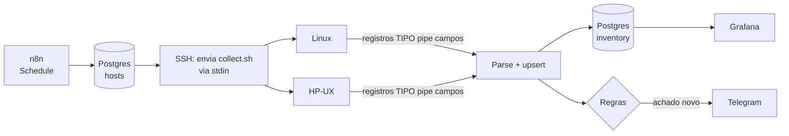

# agentless-fleet-audit

Inventário e compliance **sem agente** para servidores Linux e Unix (incluindo HP-UX), orquestrado com **n8n**, armazenado em **PostgreSQL** e visualizado no **Grafana**.

> Status: em construção. Coletor, laboratório e schema prontos; workflow n8n e dashboards em andamento.

## Problema

Em ambientes legados e híbridos é comum **não haver permissão para instalar agentes** (node_exporter, Zabbix agent, etc.), seja por política de mudança, suporte do fornecedor ou arquitetura (HP-UX em Itanium). Mesmo assim, é preciso responder perguntas como:

- Quais filesystems estão acima de 85%?
- Quais certificados vencem nos próximos 30 dias?
- Existe conta com UID 0 além do root?
- Qual o patch level (QPK) de cada HP-UX?

## Arquitetura



## Decisões técnicas

| Decisão | Motivo |
|---|---|
| **Agentless via SSH** (`sh -s < collect.sh`) | Nada é instalado nem gravado no servidor-alvo. Só exige uma conta com chave SSH. |
| **POSIX sh puro** | `bash`, `jq`, `python` e `base64` não são garantidos no HP-UX. Testado em dash, bash --posix e busybox. |
| **Saída `TIPO\|campo\|...`** em vez de JSON | Gerar JSON com escape correto em sh puro é frágil. Registro por linha é trivial de gerar e de parsear. |
| **Linha `END\|ok`** | Detecta saída truncada (queda de conexão) e marca a coleta como `partial`. |
| **`df -l` / `bdf -l`** | Só FS locais: um NFS *stale* travaria a coleta indefinidamente. |
| **Postgres, não Prometheus** | A maior parte dos dados é *estado* (usuários, certificados, patches), não métrica numérica de alta frequência. |
| **Tabela `findings` com índice único parcial** | Um achado aberto por (host, regra, objeto) → **sem alerta repetido** a cada coleta. |
| **Privilégio mínimo** | `inventory_rw` para o n8n, `grafana_ro` só leitura, portas expostas apenas em `127.0.0.1`. |

## Estrutura

```
collector/collect.sh     coletor POSIX (Linux + HP-UX)
tests/                   testes dos parsers com fixtures (inclui bdf com linha quebrada)
lab/target/              imagens dos servidores-alvo simulados (Debian, Rocky, Alpine/busybox)
db/                      init, schema e seed do Postgres
grafana/provisioning/    datasource provisionado
docker-compose.yml       laboratório completo
```

## Como rodar

Requisitos: Docker + Compose (Linux ou WSL2), `make`, `ssh`.

```sh
cp .env.example .env          # edite as senhas e gere N8N_ENCRYPTION_KEY
make up                       # gera chaves e sobe tudo
make collect-debian           # coleta manual, sem n8n, para validar
make test                     # testes do coletor
```

- n8n: http://localhost:5678
- Grafana: http://localhost:3000

O laboratório já nasce com problemas para demonstrar os alertas: `debian-01` tem `/data` em ~90% e um certificado vencendo em 20 dias, e `alpine-01` tem um certificado vencendo em 5 dias.

## Limitações conhecidas

- **HP-UX não roda no laboratório** (exige hardware Itanium/PA-RISC). Os parsers de `bdf` e `swlist` são validados com fixtures **sintéticas** no formato real.
- Em bundles PEM, só o primeiro certificado de cada arquivo é lido.
- Validade de senha (`/etc/shadow`, `chage`) exige root e fica fora do escopo sem privilégio.

## Roadmap

- [x] Coletor POSIX + testes + CI (shellcheck, dash, bash, busybox)
- [x] Laboratório Docker Compose + schema com privilégio mínimo
- [ ] Workflow n8n (coleta, parse, upsert, regras, Telegram)
- [ ] Dashboards Grafana provisionados
- [ ] Workflows versionados e importados via CI
- [ ] Terraform: mesmo stack em VM na nuvem
