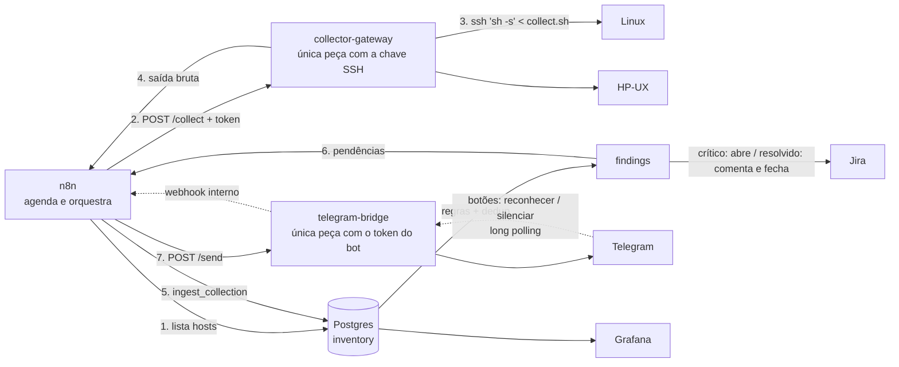
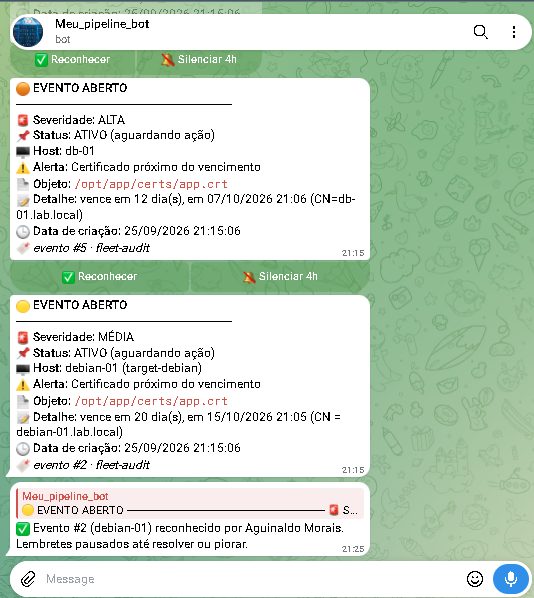
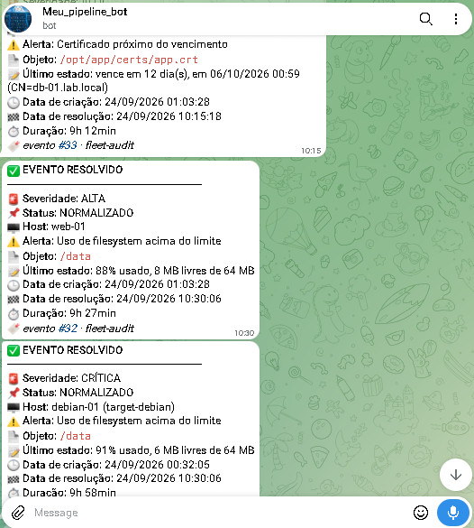
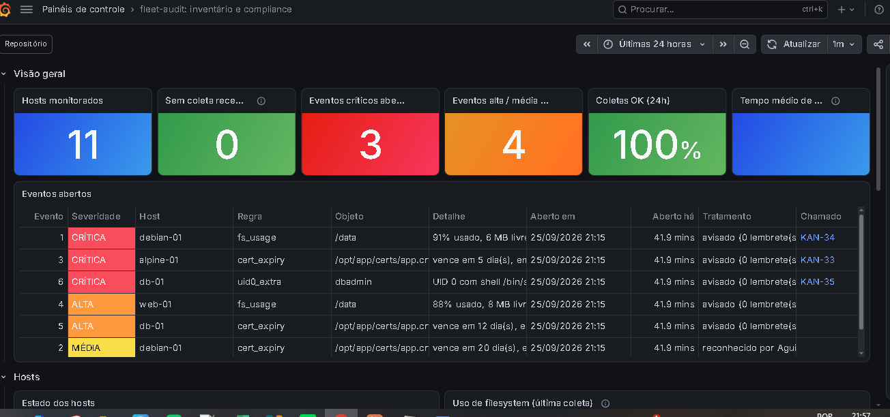
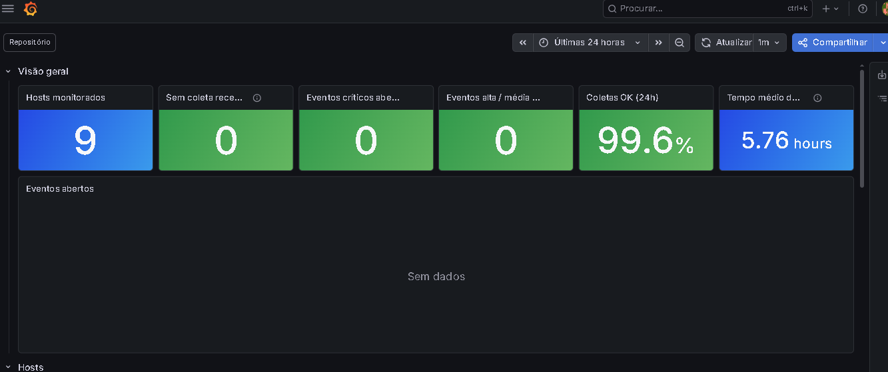
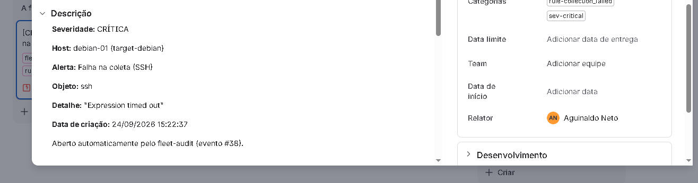
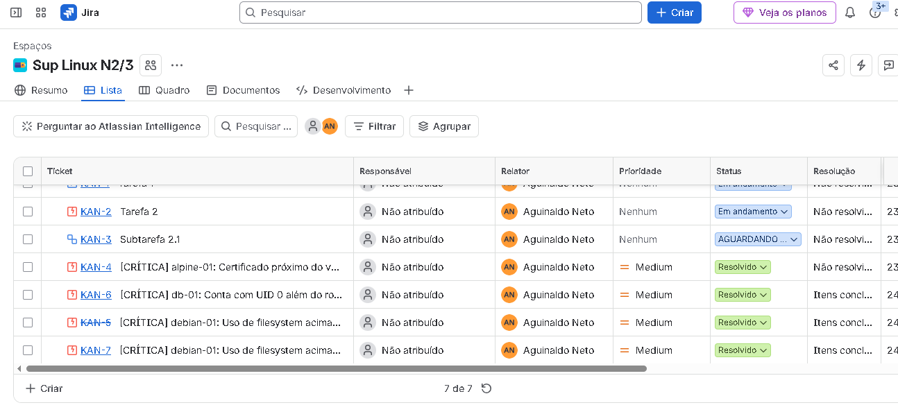

# agentless-fleet-audit

[](https://github.com/aguinaldomneto/agentless-fleet-audit/actions/workflows/ci.yml)

Inventário e compliance **sem agente** para servidores Linux e Unix (incluindo HP-UX), orquestrado com **n8n**, armazenado em **PostgreSQL** e visualizado no **Grafana**.

> Status: validado ponta a ponta numa VM na AWS (11 hosts: 3 base + 6 frota + 2 legados) — coleta (n8n → gateway → SSH → Postgres, com regras e deduplicação), alertas no Telegram, abertura e fechamento automático de chamado no Jira e dashboard Grafana provisionado como código.

## Problema

Em ambientes legados e híbridos é comum **não haver permissão para instalar agentes** (node_exporter, Zabbix agent, etc.), seja por política de mudança, suporte do fornecedor ou arquitetura (HP-UX em Itanium). Mesmo assim, é preciso responder perguntas como:

- Quais filesystems estão acima de 85%?
- Quais certificados vencem nos próximos 30 dias?
- Existe conta com UID 0 além do root?
- Qual o patch level (QPK) de cada HP-UX?

## Arquitetura



## Alertas

Um evento por mensagem, no formato de chamado, com três severidades e **lembrete enquanto o evento estiver aberto**:

| Severidade | Exemplos | Lembrete |
|---|---|---|
| 🔴 CRÍTICA | disco ≥ 90%, certificado ≤ 7 dias, UID 0 extra, falha de SSH | a cada 1 h |
| 🟠 ALTA | disco ≥ 85%, certificado ≤ 15 dias, coleta truncada | a cada 3 h |
| 🟡 MÉDIA | certificado ≤ 30 dias | a cada 8 h |

Cada alerta aberto vem com os botões **✅ Reconhecer** (pausa os lembretes até resolver) e **🔕 Silenciar 4h**. Se a severidade **subir**, o reconhecimento é desfeito e um novo alerta sai. Recuperação é sempre avisada, com data de resolução e duração. Intervalos ajustáveis com `make set-reminders`.

<table><tr>
<td></td>
<td></td>
<td></td>
</tr></table>

## Grafana

Onze hosts monitorados, eventos abertos com link direto para o chamado no Jira, uso de filesystem e certificados por vencimento — tudo lido do mesmo Postgres da ingestão.

<table><tr>
<td></td>
<td></td>
</tr></table>

## Jira

Chamado aberto automaticamente com todos os campos do evento (severidade, host, regra, detalhe) e fechado sozinho quando o Postgres marca o achado como resolvido — a transição usada é sempre a primeira de categoria "done" do fluxo do projeto, então funciona com qualquer configuração.

<table><tr>
<td></td>
<td></td>
</tr></table>

Um segundo workflow (`fleet-audit: mudanças no Jira`) observa o que um **analista humano** muda no chamado — responsável, status/fila e prioridade — e avisa no Telegram. É *polling*, não webhook: a cada 5 min busca no Jira (`JQL: labels = fleet-audit AND updated >= -15m`) os chamados tocados recentemente, compara com o que ficou salvo da rodada anterior (`jira_watch`) e só manda mensagem quando algo realmente mudou. A primeira vez que vê um chamado só grava a base, para não notificar tudo que já existia ao ligar.

## Decisões técnicas

| Decisão | Motivo |
|---|---|
| **Agentless via SSH** (`sh -s < collect.sh`) | Nada é instalado nem gravado no servidor-alvo. Só exige uma conta com chave SSH. |
| **POSIX sh puro** | `bash`, `jq`, `python` e `base64` não são garantidos no HP-UX. Testado em dash, bash --posix e busybox. |
| **Saída `TIPO\|campo\|...`** em vez de JSON | Gerar JSON com escape correto em sh puro é frágil. Registro por linha é trivial de gerar e de parsear. |
| **Linha `END\|ok`** | Detecta saída truncada (queda de conexão) e marca a coleta como `partial`. |
| **`df -l` / `bdf -l`** | Só FS locais: um NFS *stale* travaria a coleta indefinidamente. |
| **Postgres, não Prometheus** | A maior parte dos dados é *estado* (usuários, certificados, patches), não métrica numérica de alta frequência. |
| **Tabela `findings` com índice único parcial** | Um achado aberto por (host, regra, objeto) → **sem alerta repetido** a cada coleta. |
| **Gateway separado com a chave SSH** | O n8n nunca tem a chave. Se ele for comprometido, não vira um trampolim de SSH para a frota. Entrada validada contra injeção de opções do ssh. |
| **Ingestão numa função SQL** | Parse e regras rodam em **uma transação**: nada fica gravado pela metade. A saída bruta fica em `collection_runs` para auditoria e reprocessamento. |
| **Só coleta completa "apaga" ou resolve** | Saída truncada nunca remove usuário/certificado do inventário nem fecha alerta. Ausência de dado não é prova de que o problema sumiu. |
| **Perfil de SSH por host** | Legado exige algoritmo fraco (ssh-rsa/SHA-1). Em vez de afrouxar o cliente para a frota inteira, cada host declara `modern` ou `legacy` no banco; chave RSA separada da ed25519. |
| **`StrictHostKeyChecking=accept-new`** | Confia na primeira conexão e depois exige a mesma chave de host. Chave mudou (reinstalação ou MITM) = coleta falha e vira alerta crítico. |
| **Alerta de recuperação** | Achado resolvido gera aviso de "resolved", mas só se o alerta original chegou a ser enviado. |
| **Configuração de ambiente no banco** | `chat_id` do Telegram fica na tabela `settings`: o workflow versionado é o mesmo em qualquer ambiente e o repositório público não expõe dados pessoais. |
| **CI enxuto e reprodutível** | Runner e actions fixados em versão, timeout por job, execução anterior cancelada a cada push e o teste "busybox" roda num Alpine de verdade (shell **e** ferramentas). |
| **Dashboard como código** | JSON versionado, provisionado na subida, edição pela tela bloqueada (`allowUiUpdates: false`). Grafana lê com usuário somente leitura. |
| **Botões sem URL pública** | O `telegram-bridge` busca os cliques por *long polling* (`getUpdates`) e repassa ao webhook **interno** do n8n. Nada do laboratório fica exposto na internet. A ação é validada no banco: só o chat configurado pode reconhecer ou silenciar. |
| **Token do bot isolado** | Mesmo padrão do gateway SSH: o token do Telegram fica só no `telegram-bridge`; o n8n fala com ele pela rede interna com um token próprio. |
| **Jira num workflow separado** | Chamado só para evento crítico; resolução comenta duração e move para a primeira transição de categoria *done* (funciona com qualquer fluxo de projeto). Jira fora do ar não afeta o Telegram, e vice-versa. |
| **Mudança no Jira por *polling*, não webhook** | Um webhook do Jira Cloud precisaria expor o n8n publicamente (com TLS) — quebra a decisão de manter o laboratório fechado atrás de SSH. *Polling* a cada 5 min reaproveita o mesmo padrão do resto do projeto (schedule + Postgres) e a latência é irrelevante para avisar um analista de uma mudança de responsável/status/prioridade. |
| **Credenciais como código** | IDs fixos nos workflows + credenciais geradas do `.env` na subida. Clonar e rodar `make up` entrega o n8n pronto, sem escolher credencial nó a nó; trocar um token é editar o `.env` e rodar `make n8n-setup`. Teste no CI garante que todo nó aponta para uma credencial que existe. |
| **Upgrade de major sem risco** | `make pg-upgrade`: para quem escreve, `pg_dumpall`, sobe a versão nova em **volume novo**, restaura, compara a contagem de linhas de todas as tabelas e só então troca o `.env`. Qualquer falha volta sozinha para a versão anterior; o volume antigo fica intacto para rollback manual. |
| **Versões fixas** | n8n e Grafana com tag exata: `latest` mudou a interface do n8n no meio do projeto. Atualização é decisão, não acidente. |
| **Code node com teste** | JavaScript do n8n vive em `n8n/code/*.js`, com teste em Node e checagem no CI de que o JSON está sincronizado. |
| **Privilégio mínimo** | `inventory_rw` para o n8n, `grafana_ro` só leitura, portas expostas apenas em `127.0.0.1`. |
| **Rede dos alvos separada do plano de controle** | `postgres`/`n8n`/`grafana` ficam na rede `lab`; os servidores-alvo simulados (é isso que a ferramenta audita) ficam em `targets`. Só o `collector-gateway` está nas duas. Um alvo comprometido não alcança o banco/n8n/Grafana na camada de rede — só quem tem as duas pernas atravessa. |

## Estrutura

```
collector/collect.sh     coletor POSIX (Linux + HP-UX)
gateway/                 serviço HTTP que executa o coletor via SSH (Python stdlib)
telegram-bridge/         envio de mensagens e cliques nos botões do Telegram (Python stdlib)
n8n/workflows/           workflows versionados (importados com make import-workflows)
n8n/code/                código dos Code nodes, testado fora do n8n (sync_code.py embute no JSON)
tests/                   testes dos parsers com fixtures (inclui bdf com linha quebrada)
tests/sql/               testes da ingestão, regras, dedup, escalada, lembretes, ack e fila do Jira
lab/target/              imagens dos servidores-alvo simulados (Debian, Rocky, Alpine/busybox)
db/                      init, migrations versionadas e seed do Postgres
grafana/provisioning/    datasource e provider de dashboards
grafana/dashboards/      dashboard em JSON versionado (fonte da verdade)
docker-compose.yml       laboratório completo
```

## Como rodar

Requisitos: Docker + Compose (Linux ou WSL2), `make`, `ssh`.

```sh
make up                       # gera .env, chaves SSH, sobe tudo e provisiona o n8n (credenciais + workflows publicados)
make collect-debian           # coleta manual, sem n8n, para validar SSH + coletor
make n8n-setup                # reaplica credenciais (do .env) e workflows: use após mudar um token
make test                     # testes do coletor e do gateway
make test-sql                 # testes da ingestão no banco em execução
make set-chat-id CHAT_ID=...  # destino dos alertas no Telegram (fica no banco, não no Git)
make set-jira BASE_URL=https://x.atlassian.net PROJECT=OPS ISSUE_TYPE=Task   # opcional
make import-workflow WF=jira  # importa só um workflow
make fleet-up                 # +6 servidores com cenários variados (opcional)
```

Nenhuma credencial é criada na mão: `n8n/credentials.py` gera Postgres, Gateway e Bridge a partir do `.env` (e Jira, se `JIRA_EMAIL` e `JIRA_API_TOKEN` estiverem preenchidos), com IDs fixos que os workflows versionados já referenciam. O n8n cifra tudo com `N8N_ENCRYPTION_KEY` na importação. Antes de `make up`, preencha no `.env` só o `TELEGRAM_BOT_TOKEN`; o `chat_id` vai com `make set-chat-id`.

- n8n: http://localhost:5678
- Grafana: http://localhost:3000 (usuário `admin`, senha `GRAFANA_ADMIN_PASSWORD` do `.env`); o dashboard abre direto na home

O laboratório já nasce com problemas para demonstrar os alertas: `debian-01` tem `/data` em ~90% e um certificado vencendo em 20 dias, e `alpine-01` tem um certificado vencendo em 5 dias.

Para uma frota maior, `make fleet-up` sobe mais 6 servidores, cada um com um cenário (e `make fleet-down` desabilita no banco antes de parar, para não gerar alerta de falha de SSH):

| Host | Base | Cenário |
|---|---|---|
| web-01 | Debian | disco em ~88% → ALTA |
| db-01 | Rocky | conta `dbadmin` com UID 0 → CRÍTICA; certificado em 12 dias → ALTA |
| app-02 | Alpine | certificado em 25 dias → MÉDIA |
| web-02, app-01, bkp-01 | Alpine, Debian, Rocky | saudáveis |

Cada alvo é só um `sshd` ocioso (poucos MB de RAM).

### Alvos legados

`make legacy-up` sobe dois servidores com userland antigo (o kernel é o do WSL, então `uname -r` mostra kernel moderno; só o sistema em cima dele é legado):

| Host | Sistema | OpenSSH | O que demonstra |
|---|---|---|---|
| ubuntu-12 | Ubuntu 12.04 (EOL 2017) | 5.9 | não conhece ed25519: coletado com o perfil `legacy` |
| centos-7 | CentOS 7 (EOL 2024) | 7.4 | antigo, mas já fala ed25519: perfil `modern`, sem relaxar nada |

Cada host tem `ssh_profile` no banco. O perfil `legacy` usa uma chave RSA separada e libera `ssh-rsa` (SHA-1) **só para aquele host**; a frota moderna continua com os padrões do OpenSSH atual. Para ver o problema real que isso resolve:

```sh
docker compose exec postgres psql -U inventory_rw -d inventory -c "UPDATE hosts SET ssh_profile='modern' WHERE name='ubuntu-12';"
# próxima coleta: "Permission denied (publickey)" -> alerta CRÍTICO de falha de SSH
docker compose exec postgres psql -U inventory_rw -d inventory -c "UPDATE hosts SET ssh_profile='legacy' WHERE name='ubuntu-12';"
```

O coletor também foi ajustado para sistemas sem `/etc/os-release` (CentOS 6, RHEL 5/6, SLES 11): cai para `redhat-release`, `SuSE-release` ou `debian_version`.

`make lab-resolve` corrige todos os cenários de uma vez (para ver recuperação, "EVENTO RESOLVIDO" e o chamado do Jira sendo fechado) e grava um marcador para o alvo continuar saudável mesmo depois de reiniciar. `make lab-break` volta tudo ao estado de demonstração. As chaves de host dos alvos ficam em `lab/state/` (fora do Git), então recriar um container não parece ataque *man-in-the-middle* para o gateway.

## Nuvem (Terraform)

`infra/aws/` cria **uma VM x86 `m7i-flex.large` (2 vCPU / 8 GB)** com VPC própria e sobe o mesmo laboratório. É um tipo elegível ao plano gratuito de contas AWS criadas a partir de 07/2025 (consome os créditos iniciais). `infra/oci/` faz o equivalente na Oracle Cloud Always Free (ARM), mas a criação da VM costuma falhar por falta de capacidade em São Paulo.

| Decisão | Motivo |
|---|---|
| Só a porta 22 aberta, e só para o seu IP | n8n e Grafana continuam em `127.0.0.1`; acesso por túnel SSH. Nada do laboratório fica exposto na internet. |
| Segredos fora do Terraform | `user_data` fica legível para quem acessa a instância e o `tfstate` guarda tudo em texto. O `.env` é gerado **dentro** da VM (`make env`); tokens entram por SSH. |
| IMDSv2 obrigatório, disco criptografado | Metadados só com token (bloqueia o SSRF clássico de roubo de credencial). |
| Usuário IAM só com EC2 | O Terraform não usa a conta root nem permissão de administrador. |
| Liga/desliga pelo Terraform | `-var instance_state=stopped`: parada, a VM não consome crédito de CPU. |
| Imagem nova não recria a VM | `ignore_changes` na AMI: uma atualização da Canonical não apaga o laboratório num `apply`. |
| `validate` no CI | `fmt` + `validate` das duas nuvens a cada push, sem credenciais e sem criar recurso. |
| Estado remoto (S3 + lock no DynamoDB) | Pré-requisito pra rodar `apply` a partir do GitHub Actions sem perder o rastro do que já existe (run efêmera do runner não pode ser dona do `.tfstate` local). Bucket/tabela são criados por você, uma vez, fora deste Terraform — não dá pra este código gerenciar o próprio backend. |
| Deploy pelo GitHub Actions via OIDC, não chave de longa duração | `github-oidc.tf` cria um papel IAM que só o workflow deste repositório (branch configurada) pode assumir, trocando um token de curta duração — nenhum `AWS_ACCESS_KEY_ID` fica guardado em lugar nenhum, nem como secret. |

```sh
cd infra/aws
cp terraform.tfvars.example terraform.tfvars   # seu IP /32

# Estado remoto (uma vez só; nome de bucket é único em toda a AWS):
aws s3api create-bucket --bucket SEU-BUCKET-UNICO-GLOBALMENTE --region us-east-1
aws s3api put-bucket-versioning --bucket SEU-BUCKET-UNICO-GLOBALMENTE --versioning-configuration Status=Enabled
aws dynamodb create-table --table-name fleet-audit-tflock --attribute-definitions AttributeName=LockID,AttributeType=S \
  --key-schema AttributeName=LockID,KeyType=HASH --billing-mode PAY_PER_REQUEST
cp backend.hcl.example backend.hcl             # preencha o bucket acima

terraform init -backend-config=backend.hcl
terraform plan -var tfstate_bucket=SEU-BUCKET-UNICO-GLOBALMENTE
terraform apply -var tfstate_bucket=SEU-BUCKET-UNICO-GLOBALMENTE
$(terraform output -raw ssh)                    # nano agentless-fleet-audit/.env (TELEGRAM_BOT_TOKEN, JIRA_*); make up
$(terraform output -raw tunel)                  # n8n em localhost:5678, Grafana em localhost:3000
terraform apply -var instance_state=stopped -var tfstate_bucket=SEU-BUCKET-UNICO-GLOBALMENTE  # pausa (IP muda ao religar)
terraform destroy -var tfstate_bucket=SEU-BUCKET-UNICO-GLOBALMENTE                             # remove tudo
```

`tfstate_bucket` é a única variável sem valor padrão (não dá pra adivinhar um nome de bucket seu); ou exporte `TF_VAR_tfstate_bucket` pra não repetir em todo comando.

Isso é só para a primeira vez (o `.env` ainda não existe na VM, tokens entram à mão). Depois disso, o IP muda a cada `apply` mas o `.env` e o resto do disco continuam lá — `infra/aws/Makefile` religa e sobe tudo de novo com um comando só:

```sh
cd infra/aws
make up          # terraform apply (pede confirmação) + mostra ssh/túnel prontos com o IP novo
make bootstrap   # o mesmo apply, mas já entra por SSH e roda make up + fleet-up + legacy-up lá dentro
make ssh         # conecta sem copiar/colar IP
make down        # pausa (idêntico ao terraform apply -var instance_state=stopped)
```

Na Oracle (ARM), `ubuntu-12` não sobe: a imagem do Ubuntu 12.04 só existe para x86. Na AWS a VM é x86 e todos os alvos sobem.

### Ligar/pausar pelo GitHub Actions (sem chave AWS guardada)

Depois do bootstrap acima (bucket do estado remoto já existe e o primeiro `apply` já rodou), `github-oidc.tf` já criou o papel IAM. Falta só apontar o GitHub pra ele — tudo em **Settings → Secrets and variables → Actions → Variables** (nenhum destes valores é segredo, então variável comum, não secret):

| Variável | Valor |
|---|---|
| `AWS_ROLE_ARN` | saída `github_actions_role_arn` do `terraform apply` |
| `TFSTATE_BUCKET` | o bucket que você criou |
| `TFSTATE_LOCK_TABLE` | `fleet-audit-tflock` (ou o que você usou) |
| `SSH_PUBLIC_KEY` | conteúdo do seu `.pub` (`cat ~/.ssh/oci_lab.pub`) |
| `ALLOWED_SSH_CIDR` | seu IP `/32` |
| `AWS_REGION` | `us-east-1` (opcional; é o padrão) |

Com isso configurado, a aba **Actions → aws-deploy → Run workflow** liga (`up`) ou pausa (`down`) a VM direto do GitHub, sem nada rodar na sua máquina e sem `terraform apply` interativo (o workflow usa `-auto-approve` — é uma ação deliberada de quem clica "Run workflow", não algo automático a cada push).

## Operação

```sh
make pg-backup      # pg_dumpall de todos os bancos em backups/ (fora do Git)
make pg-upgrade     # 16 -> 17 (ou IMAGE=postgres:X-alpine); rollback: cp backups/env-<data>.bak .env && docker compose up -d
make lab-resolve    # corrige os cenários de demonstração / make lab-break volta
```

## Limitações conhecidas

- **HP-UX não roda no laboratório** (exige hardware Itanium/PA-RISC). Os parsers de `bdf` e `swlist` são validados com fixtures **sintéticas** no formato real.
- Em bundles PEM, só o primeiro certificado de cada arquivo é lido.
- Validade de senha (`/etc/shadow`, `chage`) exige root e fica fora do escopo sem privilégio.

## Roadmap

- [x] Coletor POSIX + testes + CI (shellcheck, dash, bash, busybox)
- [x] Laboratório Docker Compose + schema com privilégio mínimo
- [x] Gateway SSH + workflow n8n de coleta + ingestão transacional
- [x] Regras (disco, certificado, UID 0, falha de coleta) com dedup, escalada e recuperação
- [x] Notificação no Telegram (reenvio automático se o envio falhar)
- [x] Dashboard Grafana provisionado (eventos, hosts, disco, certificados, taxa de coleta, MTTR)
- [x] Chamado no Jira: abre em evento crítico, comenta e fecha na resolução
- [x] Três severidades com lembrete recorrente (1h/3h/8h) e botões Reconhecer/Silenciar no Telegram
- [x] Laboratório com 11 servidores e cenários variados (`make fleet-up` + `make legacy-up`)
- [x] n8n provisionado sem clique: credenciais do `.env`, workflows importados e publicados
- [x] Alvos legados (Ubuntu 12.04 / OpenSSH 5.9, CentOS 7) com perfil de SSH por host
- [x] Postgres 16 → 17 com `make pg-upgrade` (dump/restore verificado, rollback automático)
- [x] Terraform: mesmo stack numa VM na AWS (free tier) ou na Oracle Cloud (Always Free), só SSH exposto
- [x] `.env` validado antes de rodar (`make check-env`): CRLF, espaço sobrando, token quebrado em duas linhas
- [x] Telegram avisado em mudanças do chamado no Jira: responsável, status/fila e prioridade (`jira_watch`, *polling* a cada 5 min)
- [x] Rede dos alvos segmentada do plano de controle (`docker-compose.yml`); deploy na AWS via GitHub Actions com OIDC, sem chave de longa duração, e estado remoto (S3 + lock no DynamoDB)
